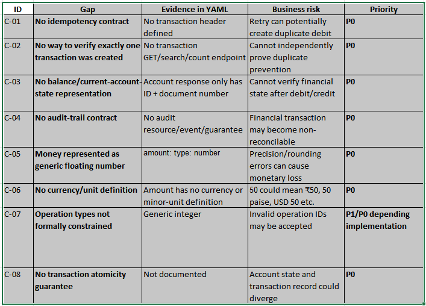

Executive assessment : 

The most important conclusion is:

The current contract is sufficient to build a useful API automation harness, but it is not sufficient to safely sign off a cardholder money-movement service.
The biggest gaps are around idempotency, balance/accounting correctness, money precision, transaction uniqueness, auditability, security, request tracing, and explicit validation rules.

The YAML describes a small Transactions Service with three operations:

API	Purpose : 
POST /accounts	---------------------------------- > Create cardholder account
GET /accounts/{accountId} ----------------------- > Retrieve account
POST /transactions ------------------------------ > Record financial operation

The transaction contract supports four operation types:

1. Normal Purchase
2. Purchase with installments
3. Withdrawal
4. Credit Voucher

Therefore my release position would be:

Release status: NO-GO for production money movement
Not because the API is necessarily broken, but because the contract does not make several critical financial guarantees observable or enforceable.

Contract gap analysis
Priority - P0 / release-blocking gaps

These are the gaps I would take immediately to the Dev/PO. 

1. <document_number> validation is unspecified :
There is no:

     minimum length
     maximum length
     regex/pattern
     numeric-only constraint
     uniqueness requirement
     normalization rule
     whitespace rule

The assignment specifically expects boundary-length and duplicate document-number testing.

2. Money representation is a major P0 :
The contract doesn't define:

     currency
     decimal precision
     maximum transaction amount
     minimum transaction amount
     whether zero is allowed
     whether negative values are allowed
     whether more than two decimal places are allowed
     rounding rules
     overflow behaviour
     minor-unit representation

The assignment specifically expects testing of zero, negative, very large, high-precision and sub-unit values.

3. Operation type needs an enum : 
     The description says:
          1 = Normal Purchase
          2 = Purchase with installments
          3 = Withdrawal
          4 = Credit Voucher
     The contract should make this machine-readable: 
          operation_type_id:
          type: integer
          enum: [1, 2, 3, 4]

4. Transaction response is incomplete for a money-movement system : 
     But it doesn't contain or expose:

          currency
          balance after transaction
          original amount
          transaction status
          idempotency key/reference
          audit reference
          processing timestamp
          request/correlation ID
          transaction reference usable by downstream systems

     For a service becoming a financial system of record, this is a significant observability gap.

5. Request ID / correlation ID missing :
     The assignment's hearsay says: Every response gets a request ID header.
     But the published contract doesn't define this.

6. Authentication/authorization missing : 
     The YAML has no securityDefinitions / security requirements.

          For a cardholder financial service this raises:

          Who can create an account?
          Who can post a transaction?
          Can one customer manipulate another account?
          Is service-to-service authentication required?
          Is authorization based on account ownership?
          Are administrative operations separated?

     This is a P0/P1 security design gap, depending on whether authentication exists outside this service.

7. Account lifecycle is incomplete : 
     There is no:

          account status
          activate/deactivate
          close account
          freeze account
          blocked account behaviour
          account balance
          transaction history

     For a simplified assignment this may be deliberately out of scope, but it should be explicitly documented as such.

8. Error contract is too weak : 
     Potential error categories:

          Condition	                                        Expected status
          Malformed JSON	                                        400
          Missing mandatory field	                              400
          Invalid amount	                                        400
          Invalid operation type	                              400/422
          Account not found	                                   404
          Duplicate document	                                   409
          Idempotency conflict	                              409
          Unauthorized	                                        401
          Forbidden	                                             403
          Unsupported media type	                              415

     Current contract does not sufficiently define these behaviours.

9. What I would classify as the top P0 risks :
     Rank	          Failure mode	                         Impact	         Likelihood	          Risk
     1	     Double debit / duplicate transaction	Catastrophic	          High	                 P0
     2	     Incorrect amount/balance	               Catastrophic	          Medium	            P0
     3	     Lost transaction/audit record	          Catastrophic	          Medium	            P0
     4	     Transaction/account inconsistency	     Catastrophic	          Medium	            P0
     5	     Unauthorized money movement	          Catastrophic	          Medium	            P0
     6	     Incorrect sign by operation type	     High	                    Medium	            P1
     7	     Precision/rounding error	               High	                    Medium	            P1/P0
     8	     Invalid account/document accepted	     Medium/High	          Medium	            P1
     9	     Poor latency	                         Medium	               Unknown	            P2
     10	     Cosmetic/schema inconsistency	          Low	                    Medium	            P3

     | Rank | Failure mode                         |       Impact | Likelihood | Risk      |
     | ---- | ------------------------------------ | -----------: | ---------: | --------- |
     | 1    | Double debit / duplicate transaction | Catastrophic |       High |     P0    |
     | 2    | Incorrect amount/balance             | Catastrophic |     Medium |     P0    |
     | 3    | Lost transaction/audit record        | Catastrophic |     Medium |     P0    |
     | 4    | Transaction/account inconsistency    | Catastrophic |     Medium |     P0    |
     | 5    | Unauthorized money movement          | Catastrophic |     Medium |     P0    |
     | 6    | Incorrect sign by operation type     |         High |     Medium |     P1    |
     | 7    | Precision/rounding error             |         High |     Medium |     P1/P0 |
     | 8    | Invalid account/document accepted    |  Medium/High |     Medium |     P1    |
     | 9    | Poor latency                         |       Medium |    Unknown |     P2    |
     | 10   | Cosmetic/schema inconsistency        |          Low |     Medium |     P3    |

10 . What can be automated RIGHT NOW

     There is actually quite a lot we can automate against the YAML.

          Automation Tier 1 — Contract/schema validation
          Fully automatable now
          YAML syntax validation
          Swagger 2.0 validation
          endpoint existence
          HTTP method validation
          request schema validation
          response schema validation
          content type
          response status
          field types
          required/non-required behaviour as currently defined
          malformed payloads
          unsupported methods

11. API functional automation : 

     We can immediately automate:

     Tests:

          valid document
          empty document
          missing document
          duplicate document
          boundary lengths
          invalid characters
          whitespace
          null
          wrong datatype

     Tests:

          existing account
          non-existing account
          zero
          negative ID
          malformed ID
          very large ID
          unsupported HTTP methods

12. Transaction automation :

     Verify :
          201
          account_id
          amount
          operation_type_id
          transaction_id
          event_date
          type
13. Negative transaction automation : 

     missing account_id
     missing amount
     missing operation_type_id
     account not found
     amount = 0
     amount < 0
     amount = very large
     amount = 10.123456789
     operation_type_id = 0
     operation_type_id = 5
     operation_type_id = 999
     null values
     strings instead of numbers
     empty JSON
     malformed JSON
     wrong Content-Type

14. QA vs Developer ownership : 

| Area                       | Dev               | QA                                 |
| -------------------------- | ----------------- | ---------------------------------- |
| Unit calculation           | **Own**           | Review/risk-based                  |
| Amount precision           | **Own**           | Independently validate             |
| DB constraints             | **Own**           | Verify via API/integration         |
| Idempotency implementation | **Own**           | Independently challenge            |
| Race conditions            | **Own**           | Integration/concurrency validation |
| Contract schema            | Dev + QA          | **QA contract audit**              |
| API functional behaviour   | Dev + QA          | **QA**                             |
| Business scenarios         | Shared            | **QA lead**                        |
| E2E journey                | Dev support       | **QA**                             |
| Security abuse cases       | Dev + Security    | **QA validation**                  |
| Performance                | Dev/Platform + QA | **QA/Performance**                 |
| Production monitoring      | Dev/Platform      | QA defines quality signals         |
| Release risk decision      | Shared            | **QA recommends GO/NO-GO**         |

tests/
│
├── contract/
│   ├── openapi-schema.spec.ts
│   └── response-contract.spec.ts
│
├── accounts/
│   ├── create-account.spec.ts
│   ├── account-validation.spec.ts
│   └── get-account.spec.ts
│
├── transactions/
│   ├── purchase.spec.ts
│   ├── installment.spec.ts
│   ├── withdrawal.spec.ts
│   ├── credit-voucher.spec.ts
│   ├── amount-validation.spec.ts
│   ├── account-validation.spec.ts
│   └── operation-type.spec.ts
│
├── cross-cutting/
│   ├── malformed-json.spec.ts
│   ├── content-type.spec.ts
│   ├── method-not-allowed.spec.ts
│   └── request-id.spec.ts
│
├── idempotency/
│   └── concurrent-replay.spec.ts
│
└── e2e/
    └── cardholder-transaction-journey.spec.ts

15. Quality dashboard : 
     Release manager dashboard

     ========================================================
               TRANSACTIONS SERVICE QUALITY
     ========================================================

     RELEASE: v1.0.x

     P0 DEFECTS                  2   🔴
     P1 DEFECTS                  1   🟠
     CONTRACT BLOCKERS           6   🔴
     CRITICAL TESTS PASS         100%
     IDEMPOTENCY VERIFIED        BLOCKED
     MONEY PRECISION VERIFIED    BLOCKED
     SECURITY GATE               BLOCKED
     AUDITABILITY VERIFIED       BLOCKED

     --------------------------------------------------------
     FINANCIAL CORRECTNESS

     Purchase sign correctness       PASS
     Withdrawal sign correctness     PASS
     Credit sign correctness         PASS
     Invalid amount rejection        PASS
     Precision validation            BLOCKED
     Balance reconciliation           BLOCKED

     --------------------------------------------------------
     AUTOMATION HEALTH

     Contract validation             PASS
     API functional                  PASS
     Negative API                    PASS
     E2E critical journey            PASS
     Flaky tests                     0
     Environment failures            0

     --------------------------------------------------------
     PRODUCTION SIGNALS

     Duplicate transaction rate      < threshold
     Transaction failure rate        < threshold
     5xx rate                        < threshold
     P95 latency                     < agreed SLO
     Reconciliation mismatches       0
     --------------------------------------------------------
     RELEASE DECISION:                NO-GO
     Reason: Critical financial
     guarantees not contractually
     observable.
     ========================================================

16. Release-blocking questions : 

     | Question                                       | Status           |
     | ---------------------------------------------- | ---------------- |
     | What is the idempotency mechanism/header?      | 🔴 **BLOCKING**  |
     | How is exactly-one transaction verified?       | 🔴 **BLOCKING**  |
     | What is the balance/account-state model?       | 🔴 **BLOCKING**  |
     | What is the currency?                          | 🔴 **BLOCKING**  |
     | What is the money precision/minor unit?        | 🔴 **BLOCKING**  |
     | What are max/min transaction amounts?          | 🔴 **BLOCKING**  |
     | Are document numbers unique?                   | 🔴 **BLOCKING**  |
     | What guarantees transaction + audit atomicity? | 🔴 **BLOCKING**  |
     | How is authentication/authorization enforced?  | 🔴 **BLOCKING**  |
     | What happens with duplicate requests?          | 🔴 **BLOCKING**  |
     | What is the transaction status model?          | 🟠 P1            |
     | What is the error-code taxonomy?               | 🟠 P1            |
     | What is the request/correlation ID convention? | 🟠 P1            |
     | Are account lifecycle operations out of scope? | 🟡 Clarification |
     | Is performance currently an SLO?               | 🟡 Clarification |
     | Is transaction history intentionally absent?   | 🟡 Clarification |
