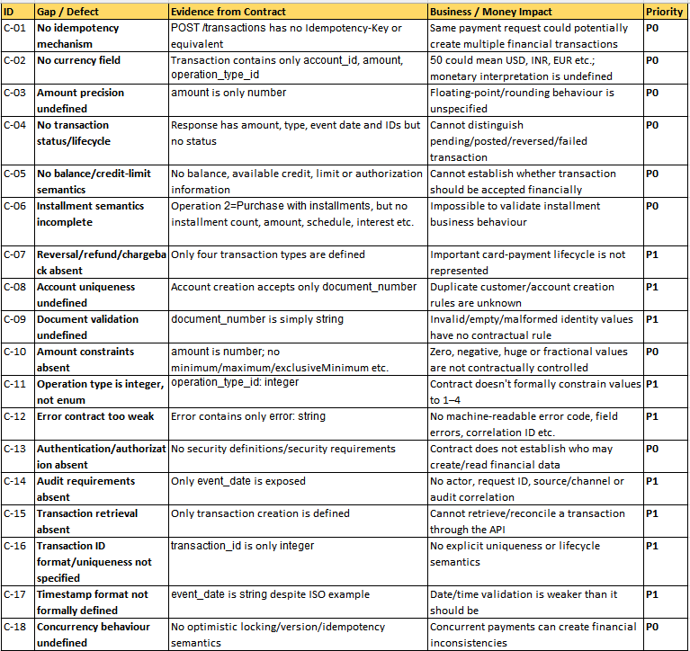
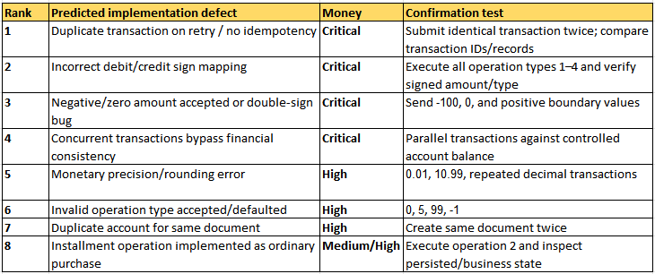

The Most Important C5 Observation :

The contract is adequate for testing basic CRUD-style API behaviour, but it is not yet a sufficient financial-system oracle. The highest-risk gaps are idempotency, monetary precision, transaction validity, account financial constraints, concurrency and transaction lifecycle. Therefore, the prediction suite deliberately focuses on defects that could create duplicate charges, incorrect credits/debits or financially inconsistent account state.

That is much stronger than simply saying "more test cases are required."

The supplied contract explicitly establishes only the basic account and transaction interfaces and their HTTP outcomes.

-------------------------------------------------------------------------------------------------------
     C5 — Defect Register & Prediction
1. Executive Summary

     Contract position : 
     The current contract is sufficient to automate the basic API contract and happy/negative-path behaviour, but it is not sufficient to establish financial correctness of a production-grade cardholder transaction service.

     The biggest missing areas are:

          -   Idempotency / duplicate transaction protection
          -   Currency and monetary precision
          -   Account balance / available credit semantics
          -   Transaction limits
          -   Transaction state/lifecycle
          -   Reversal/refund/chargeback
          -   Installment semantics
          -   Concurrency/atomicity
          -   Authentication/authorization
          -   Auditability and correlation
          -   Strong input constraints
          -   Stable error model
          -   Business rules around account/document uniqueness

     The contract currently says that a transaction is recorded against an existing account and that the server applies the correct sign based on operation type.

     That makes financial sign correctness, duplicate charging, monetary precision and account integrity the highest-value prediction areas.

2. Contract Defects / Gaps

     These are contract-level defects or omissions, not claims that the implementation is broken.
     

3. Most Important Contract Gap : 
     The contract describes how to record a transaction, but not the financial rules that determine whether the transaction is valid.

          For example:
          {
          "account_id": 1,
          "amount": 100,
          "operation_type_id": 1
          }

     The contract tells us: Send positive amount; server applies the correct sign.

          But it does not tell us:

          -   Which currency?
          -   Does account have sufficient balance/credit?
          -   What is the account's current balance?
          -   What is the credit limit?
          -   Is this transaction authorized?
          -   Can the same request be submitted twice?
          -   What happens when two requests arrive simultaneously?
          -   What is the maximum transaction?
          -   How are cents handled?
          -   What happens for 0?
          -   What happens for 100.999?
          -   What exactly constitutes an installment purchase?

     That is a significant limitation for a financial API.

4. Predicted Implementation Defects : 

     # P - 01 Duplicate transaction / double charge
     Prediction

          The implementation will probably create two financial transactions when the same transaction request is submitted twice.

     # Why I predict it : The contract has no idempotency key or duplicate-request semantics.

     The "POST /transactions" simply accepts the transaction payload and returns 201 Created.
     A real payment client may retry because of:

          -   network timeout
          -   gateway timeout
          -   client retry
          -   load balancer retry
          -   mobile connectivity issue

     The server may receive the original request and the retry.
     
     # Exact confirming test, Send exactly the same request twice: 
          {
               "account_id": 1,
               "amount": 100.00,
               "operation_type_id": 1
          }
     Expected observation, Prediction confirmed if:

          Request 1 → 201 → transaction_id = 101
          Request 2 → 201 → transaction_id = 102

     with two financial records created.

     # Correct financial behaviour

     The system should have a defined idempotency strategy.
     For example:
          same idempotency key
               ↓
          same logical transaction
               ↓
          no second financial posting
     Money impact : Very High / P0
     A duplicate payment is a direct financial-loss/customer-impact defect.

     -------------------------------------------------------------------------------------------------

     # P-02 — Wrong debit/credit sign handling (Very High / P0)
          Prediction : 
               One or more operation types will apply the wrong sign, particularly Credit Voucher.

          The contract explicitly says:
               positive amount is supplied and the server applies the correct sign based on operation type.
          That makes this an extremely valuable implementation prediction.

          # Test
               Execute:
                    operation_type_id = 1
                    amount = 100
          and:

                    operation_type_id = 4
                    amount = 100
          Expected observation, based on the contract's transaction response example:
               Operation	                       Expected financial direction

               1 — Normal Purchase	                    Debit / negative
               2 — Installment Purchase	               Debit / negative
               3 — Withdrawal	                         Debit / negative
               4 — Credit Voucher	                    Credit / positive
          
          Prediction is a : Very High / P0

     # P-03 — Negative or zero amount bypasses business validation (Money impact - Very High / P0)
          Prediction : 
               The implementation may only check: amount != null
          rather than:
               amount > 0
          The description explicitly says: "Send a positive amount."

          But the schema does not formally enforce this with minimum: 0 / exclusiveMinimum.

     # P-04 — Decimal/rounding defect (Money impact : High / P0)
          Prediction : 
               The implementation may mishandle decimal monetary values.

          The schema defines:
               amount:
                    type: number

               but provides no:

               format: decimal
                    multipleOf: 0.01

          or equivalent financial precision rule.
          Potential defects: incorrect rounding/truncation.

     # P-05 — Invalid operation type accepted (Money impact : High / P0)
          Prediction : 
               The implementation may accept an arbitrary integer because the API schema defines:
          YAML : 
               operation_type_id:
                    type: integer

          rather than formally restricting it to: 1,2,3,4.
          The description provides the mapping but not a schema enum.
          Expected status error : 400 / 422.
          Message : NO transaction created.

     # P-06 — Concurrent transaction race condition (Money impact : Very High / P0)
          Prediction : 
               Two transactions submitted simultaneously against the same account may both succeed when only one should. This is especially relevant because the API represents a financial operation against an existing account.

          Prediction Implementation may do:

               Thread A → read balance = 100
               Thread B → read balance = 100

               A → approve 80
               B → approve 80

               Result → 160 consumed from 100
               Confirmation observation

          Use:

               -   20–100 concurrent requests
               -   same account
               -   controlled starting balance
               -   database/post-transaction state.
          Also, no transaction acoount or audit access API's to confirm the transaction so its very high.
     
     # P-07 — Installment transaction behaves like normal purchase (Money impact : High)

          The contract states:
               2 = Purchase with installments
          but there is no installment-specific information in the request.

          Observation : 
          Verify whether there is any:

               -   installment count
               -   installment schedule
               -   principal allocation
               -   interest
               -   next due date
               -   installment status
               -   Prediction

          Nothing exists beyond a simple transaction row.
          Money impact : High, but partly a contract-definition problem, not necessarily an implementation defect.

     # P-08 — Duplicate account creation for same document (Money impact : High)
          The account creation API accepts only: document_number
               and 
          returns: 
               -   account_id
               -   document_number
          
          Prediction : The implementation may create multiple accounts for the same document.
          Expected Behavior : 
               Business rule should be explicitly defined, but for a normal customer-account model I would expect:
                    -   first → 201
                    -   duplicate → 400/409
                    

5. Prediction Ranking — What I Would Defend in the Debrief : 
     

6. What Can Be Automated NOW : 

     The API explicitly defines:

          -   POST /accounts
          -   GET /accounts/{accountId}
          -   POST /transactions
          -   request schemas
          -   response schemas
          -   expected HTTP statuses
          -   four operation types.
     A. Contract/schema automation : 
          Automate:

               -   Request schema validation
               -   Response schema validation
               -   Required field validation
               -   Data type validation
               -   HTTP status validation
               -   Content-Type validation
               -   Unexpected response structure

     B. Account API automation : 
          Negative : 
               -   missing body
               -   missing document_number
               -   wrong data type
               -   empty document_number
               -   invalid account ID
               -   non-existent account
               -   wrong HTTP method

7. Transaction API Automation NOW : 
     Core automated matrix : 
          | Scenario                    | Automatable now? | Oracle                          |
          | --------------------------- | ---------------- | ------------------------------- |
          | Valid purchase              |               ✅ | Contract                        |
          | Valid installment operation |               ✅ | Contract                        |
          | Valid withdrawal            |               ✅ | Contract                        |
          | Valid credit voucher        |               ✅ | Contract                        |
          | Missing account ID          |               ✅ | Contract/schema                 |
          | Missing amount              |               ✅ | Contract/schema                 |
          | Missing operation type      |               ✅ | Contract/schema                 |
          | Invalid account ID          |               ✅ | Contract/status                 |
          | Invalid operation type      |               ⚠️ | Description, contract gap       |
          | Negative amount             |               ⚠️ | Description says positive       |
          | Zero amount                 |               ⚠️ | Business rule inferred          |
          | Duplicate transaction       |               ⚠️ | Prediction                      |
          | Decimal precision           |               ⚠️ | Financial invariant             |
          | Concurrent transaction      |               ⚠️ | Implementation/system behaviour |
          | Idempotency                 |  ❌ contract gap | Needs contract decision         |
          | Balance validation          |               ❌ | No balance contract             |
          | Refund/reversal             |               ❌ | Not represented                 |
          | Installment schedule        |               ❌ | Missing contract model          |

8. TTD — Tests To Develop / Pending : 

     TTD-01 — Idempotency - Need from product/contract.
     TTD-02 — Financial precision - Need explicit contract decision.
     TTD-03 — Account financial rules.
     TTD-04 — Installments.
          Need:
               -   installment_count
               -   installment_amount
               -   interest
               -   fees
               -   schedule
               -   due_date
               -   remaining_balance
          Then create an installment-specific test model.
     TTD-05 — Transaction lifecycle
          Need:
               -   AUTHORIZED
               -   POSTED
               -   REVERSED
               -   REFUNDED
               -   FAILED
               -   DECLINED
          and APIs/events supporting those transitions.
     TTD-06 — Security - The current contract does not expose security requirements.
          Need:
               -   Authentication
               -   Authorization
               -   Role/access model
               -   Token requirements
               -   PII protection
               -   TLS requirements
               -   Rate limiting
               -   Audit

9. Exact C5 Test Strategy : 

| Prediction           | Test                           | Observation                | Pass/Fail |
| Duplicate transaction| Submit identical POST twice| 2 transaction IDs = defect | ❌  |
| Wrong sign | Execute operation 1–4 | Returned/stored amount doesn't match operation semantics | ❌ |
| Negative amount       | POST `amount=-100`| Transaction created = defect  | ❌  |
| Zero amount           | POST `amount=0`                 | Transaction created = defect  | ❌ |
| Race condition        | Parallel transactions  | Financial state exceeds allowed limit | ❌  |
| Precision             | Submit `10.99`, repeated `0.01` | Stored/returned value differs| ❌  |
| Invalid operation     | `operation_type_id=99`          | Transaction created = defect | ❌  |
| Duplicate account|Same document twice|Multiple accounts created contrary to expected uniqueness| ❌ |
